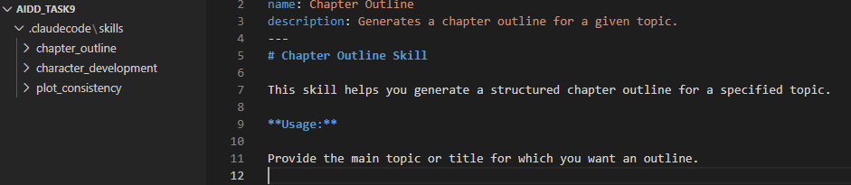
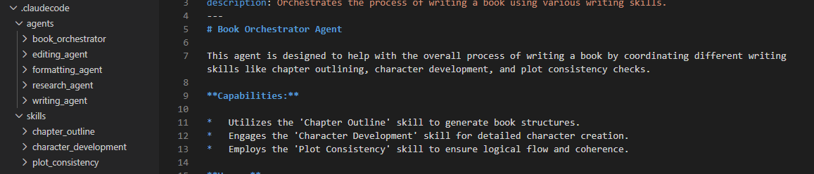

## Task 9 Claude Code Skills Submission

Student: Foqia Siddiqui
Course: AI-Driven Development – 30-Day Challenge
Instructor: Sir Hamzah Syed

✅ Overview

For Task 9, I created three Claude Code Skills inside the .claudecode/skills directory.
These skills support automated book generation, helping with structure, character creation, and plot integrity.

🛠 Created Skills
1. Chapter Outline Generator

A skill that generates structured book chapter outlines, including chapter titles, summaries, and story flow. It follows narrative structure and maintains consistent pacing.

2. Character Development Assistant

A skill that builds detailed character profiles, including personality traits, motivations, arcs, relationships, and unique behavioural patterns for the story.

3. Plot Consistency Checker

A skill that analyzes chapters or story content to detect logic gaps, inconsistencies, timeline issues, contradictions, and missing information, while suggesting improvements.

## Task 10 Claude Code Sub-Agents Submission

✅ Overview

For Task 10, I created a complete Sub-Agent system inside the .claudecode/agents directory.
These sub-agents collaborate to generate a full book through research, writing, editing, and formatting.
A Main Orchestrator Agent coordinates all sub-agents.

This setup prepares for multi-agent orchestration used in real-world AI systems and the upcoming Hackathon.

🧠 Created Agents
🔵 1. Main Orchestrator Agent

Filename: book_orchestrator.agent.json
Coordinates all sub-agents, manages workflow, passes information between them, and ensures the book is generated step-by-step.

🟢 2. Research Sub-Agent

Filename: research_agent.agent.json
Collects relevant background information, facts, settings, and helpful details to support chapter writing.

🟡 3. Writing Sub-Agent

Filename: writing_agent.agent.json
Creates book chapters based on the research. Produces coherent, well-developed narrative sections.

🔴 4. Editing Sub-Agent

Filename: editing_agent.agent.json
Improves grammar, clarity, flow, tone consistency, and fixes logical issues in the written content.

🟣 5. Formatting Sub-Agent

Filename: formatting_agent.agent.json
Applies headings, organizes chapters, adjusts layout, and formats the final book for clean output.

